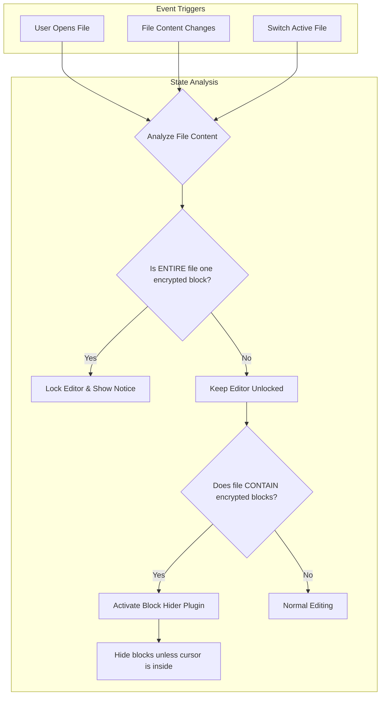
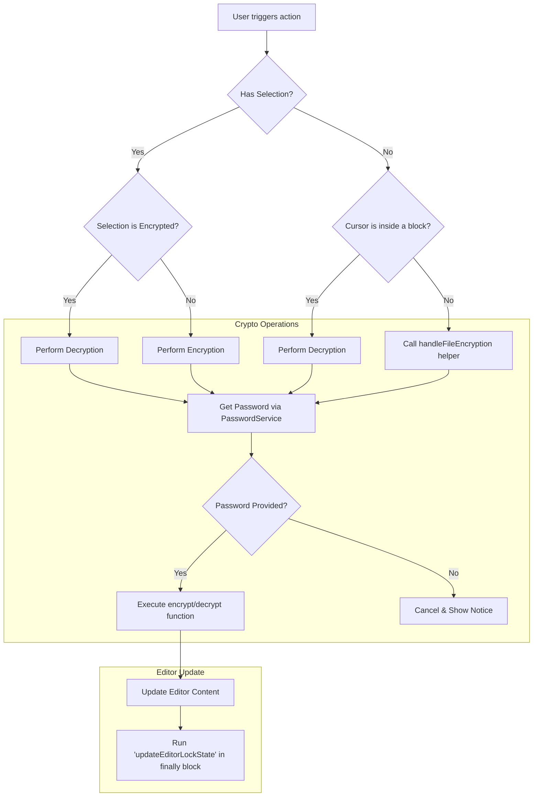

Of course. Here are the updated flow diagrams based on the final, reviewed code, reflecting the refactoring and new features.

# Obsidian Encryptor Flow Diagrams (Updated)

## 1\. File State & UI Management

This diagram now includes the **Encrypted Block Hider** feature, which is distinct from locking the entire file.



-----

## 2\. Encryption/Decryption Logic Flow

This flow reflects the refactored logic, which prioritizes the context (selection, cursor position, or entire file) and uses a helper for file-level operations.



-----

## 3\. Password Service Flow

This diagram is now centered on the `PasswordService`, which centralizes and manages the password prompt to prevent duplicates.

```mermaid
flowchart TD
    A[Component needs password] --> B[Calls passwordService.promptPassword()]
    B --> C{Is a prompt already active?}
    C -->|Yes| D[Return existing promise]
    C -->|No| E[Create new Promise]
    E --> F[Open PasswordPromptModal]

    subgraph Modal Interaction
        F --> G{User submits or cancels}
        G -->|Submit| H[Resolve Promise with password]
        G -->|Cancel / Close| I[Resolve Promise with null]
    end

    H & I & D --> J[Return result to caller component]
    J --> K{Password is not null?}
    K -->|Yes| L[Caller proceeds with operation]
    K -->|No| M[Caller cancels operation]
```

-----

## 4\. Editor Lock State Management (`checkAndUpdateLockState` function)

This flow details the specific logic of the function responsible for managing the editor's read-only state.

```mermaid
flowchart TD
    A[call checkAndUpdateLockState(forceState?)] --> B{Determine 'shouldBeLocked'}
    B -->|forceState provided| C[Use forceState value]
    B -->|forceState is null| D[Check if entire file is encrypted]
    
    C & D --> E[Get current editor lock state 'isLocked']
    E --> F{shouldBeLocked === isLocked?}
    F -->|Yes| G[No change needed, return]
    F -->|No| H[Dispatch reconfigure effect to update lock state]
    H --> I{Editor is now locked?}
    I -->|Yes| J[Show 'File Locked' Notice]
    I -->|No| K[State is Unlocked]
```

-----

## 5\. Error & Final State Handling (`try...catch...finally`)

This diagram shows the robust error handling and state cleanup pattern used in the main logic.

```mermaid
flowchart TD
    A[Start Operation] --> B[try]
    
    subgraph try
        B -- Executes --> C[Perform crypto logic & editor updates]
    end

    subgraph catch
        B -- Fails --> D[catch (e)]
        D --> E[Log full error to console]
        E --> F[Show user-friendly error Notice]
    end

    subgraph finally
        B -- Always runs after --> G[finally]
        G --> H[setTimeout]
        H --> I[call updateEditorLockState()]
        I --> J[Ensure final editor state is correct]
    end
```
