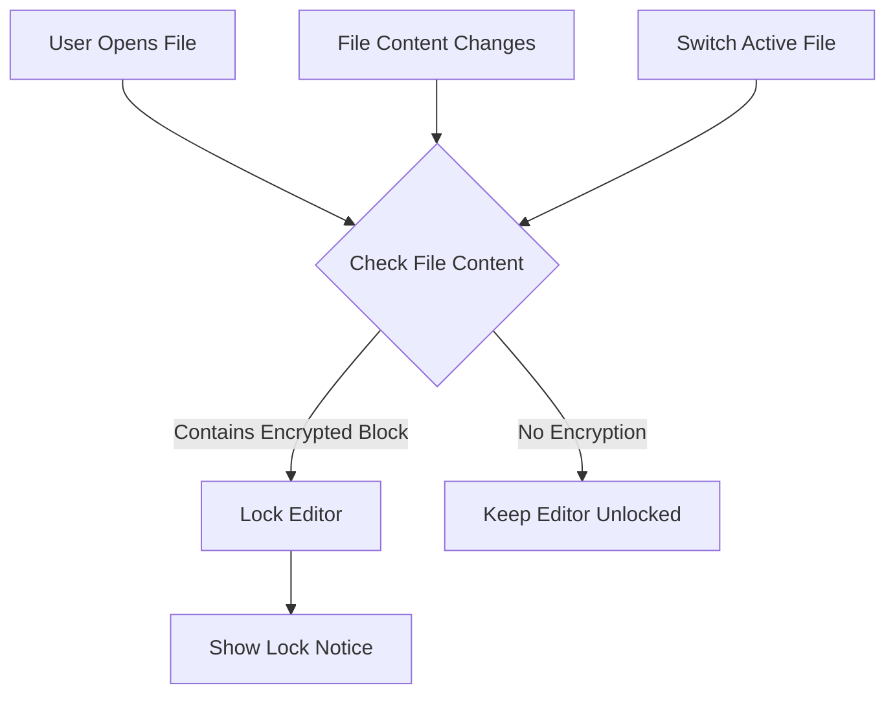
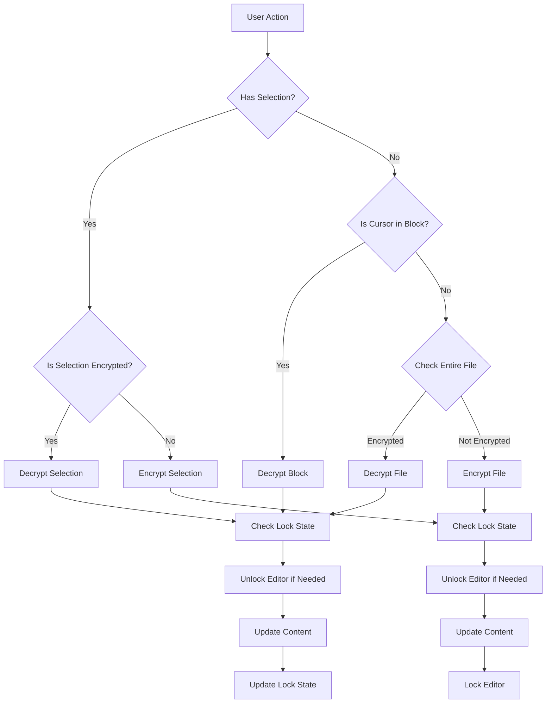
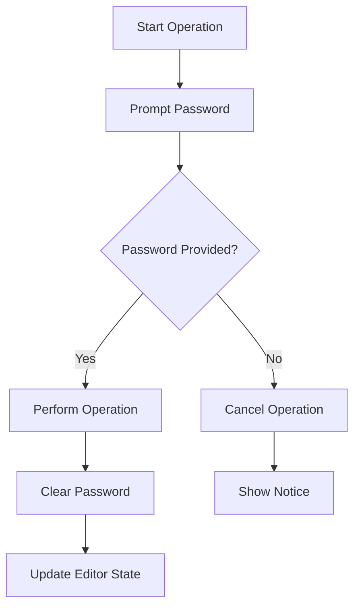
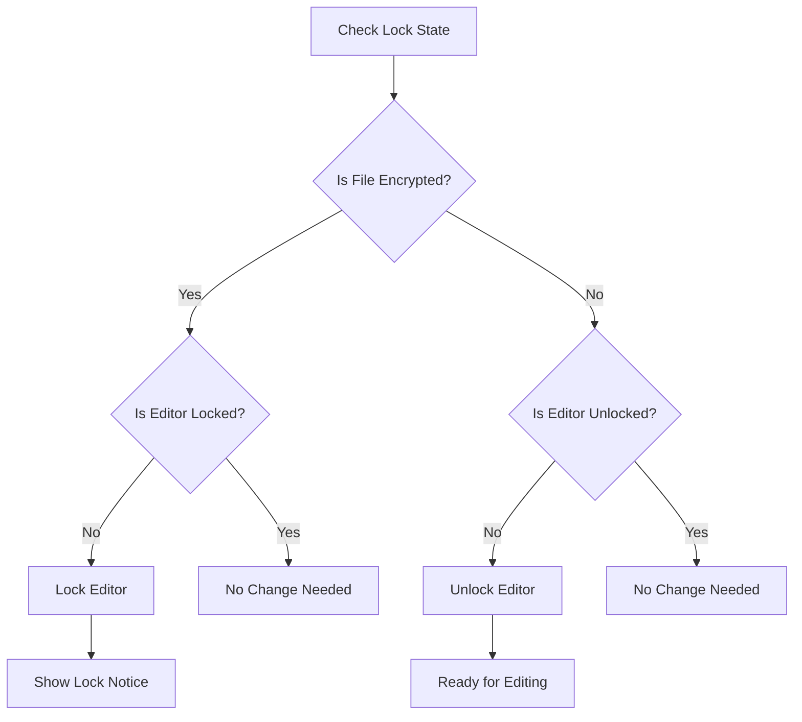
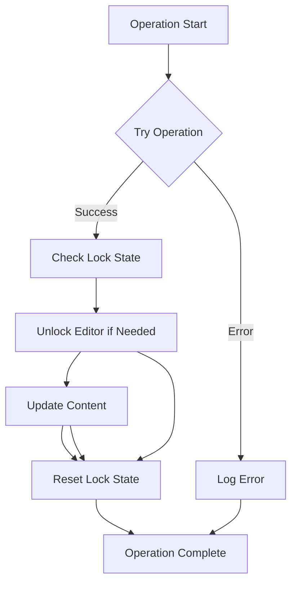

# Obsidian Encryptor Flow Diagrams

## File Locking Mechanism

```mermaid
flowchart TD
    A[User Opens File] --> B{Check File Content}
    B -->|Contains Encrypted Block| C[Lock Editor]
    B -->|No Encryption| D[Keep Editor Unlocked]
    C --> E[Show Lock Notice]
    
    F[File Content Changes] --> B
    G[Switch Active File] --> B
```

## Encryption/Decryption Flow

```mermaid
flowchart TD
    A[User Action] --> B{Has Selection?}
    B -->|Yes| C{Is Selection Encrypted?}
    B -->|No| D{Is Cursor in Block?}
    
    C -->|Yes| E[Decrypt Selection]
    C -->|No| F[Encrypt Selection]
    
    D -->|Yes| G[Decrypt Block]
    D -->|No| H{Check Entire File}
    
    H -->|Encrypted| I[Decrypt File]
    H -->|Not Encrypted| J[Encrypt File]
    
    E & G & I --> K[Check Lock State]
    K --> L[Unlock Editor if Needed]
    L --> M[Update Content]
    M --> N[Update Lock State]
    
    F & J --> O[Check Lock State]
    O --> P[Unlock Editor if Needed]
    P --> Q[Update Content]
    Q --> R[Lock Editor]
```

## Password Handling Flow

```mermaid
flowchart TD
    A[Start Operation] --> B[Prompt Password]
    B --> C{Password Provided?}
    C -->|Yes| D[Perform Operation]
    C -->|No| E[Cancel Operation]
    
    D --> F[Clear Password]
    F --> G[Update Editor State]
    
    E --> H[Show Notice]
```

## Editor Lock State Management

```mermaid
flowchart TD
    A[Check Lock State] --> B{Is File Encrypted?}
    B -->|Yes| C{Is Editor Locked?}
    B -->|No| D{Is Editor Unlocked?}
    
    C -->|No| E[Lock Editor]
    C -->|Yes| F[No Change Needed]
    
    D -->|No| G[Unlock Editor]
    D -->|Yes| H[No Change Needed]
    
    E --> I[Show Lock Notice]
    G --> J[Ready for Editing]
```

## Error Handling Flow

```mermaid
flowchart TD
    A[Operation Start] --> B{Try Operation}
    B -->|Success| C[Check Lock State]
    B -->|Error| D[Log Error]
    
    C --> E[Unlock Editor if Needed]
    E --> F[Update Content]
    F --> G[Update Editor State]
    D --> H[Show Error Notice]
    
    E & F --> G[Reset Lock State]
    G --> H[Operation Complete]
```
